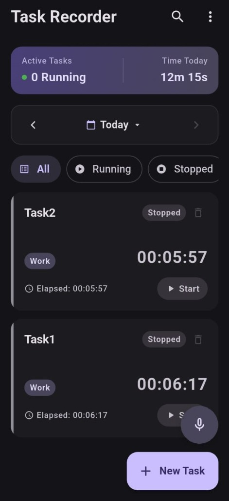
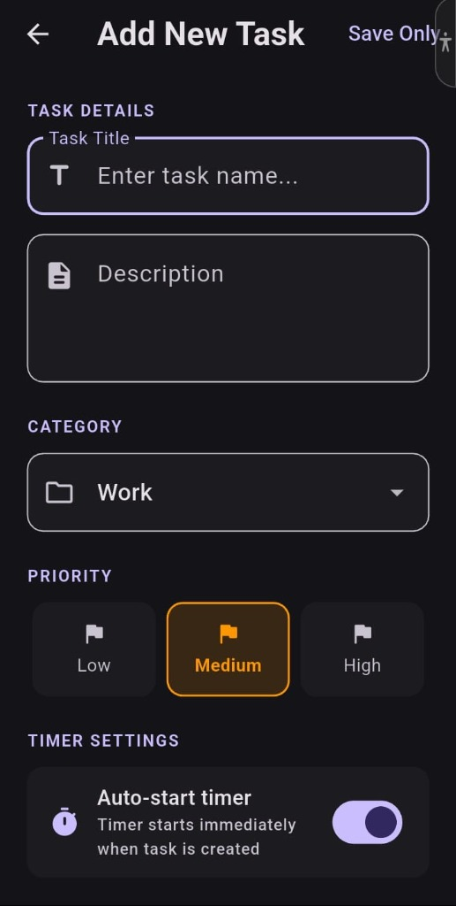
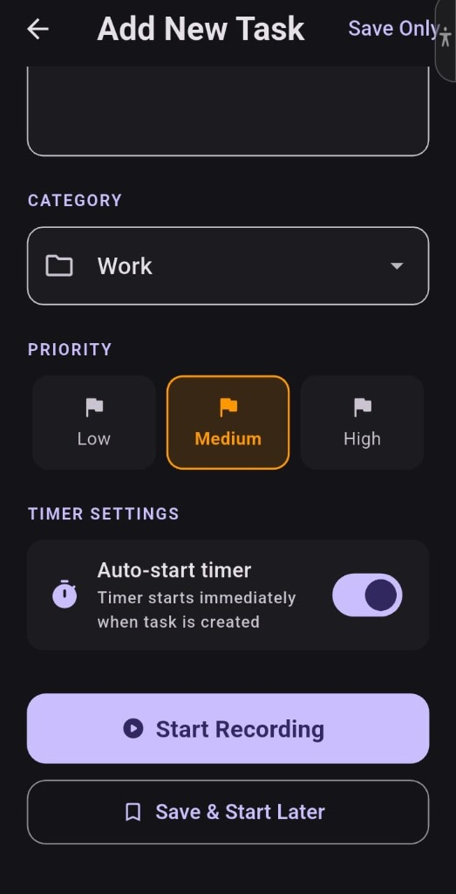
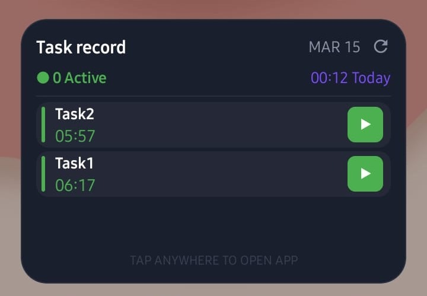

# 📋 Task record

**Task record** is a premium, high-performance Flutter application designed for seamless daily task tracking and productivity management. It features a sleek dark-mode interface, real-time tracking, and voice-to-task integration.

---

## 📸 Screenshots

| Dashboard | Add Task Details | Add Task Recording | Home Screen Widget |
| :---: | :---: | :---: | :---: |
|  |  |  |  |

---

## 🚀 Download Final APK

[](https://github.com/Sanjay36yt/Task-record/raw/main/release/Task_record.apk)

You can find the ready-to-install Android build here:
👉 **[Click here to download Task_record.apk](https://github.com/Sanjay36yt/Task-record/raw/main/release/Task_record.apk)**

---

## ✨ Key Features

### 📅 Smart Dashbord
The central hub of the application, featuring:
- **Summary Bar**: Real-time stats on your active tasks and total time spent today.
- **Date Navigator**: Seamlessly jump between days to review your past productivity records.
- **Dynamic Task List**: Premium task cards showing status, category, and a live ticking timer.
- **Global Search**: Instantly find any task by name or category.

### 🎙️ Voice-to-Task
- **Hands-free creation**: Use the floating voice button to dictate task details.
- **Intelligent parsing**: Automatically creates and categorizes tasks from your speech.

### 🏠 Interactive Home Screen Widget
Stay productive without even opening the app:
- **Real-time Ticking**: See your active task's elapsed time pulse directly on your home screen.
- **One-Tap Control**: Start and Stop tasks instantly via interactive widget buttons.
- **Scrollable List**: View all your daily tasks in a sleek, scrollable widget interface.
- **Manual Refresh**: Fetch the latest updates with a dedicated sync icon.

### 🎨 Premium Design
- **Dark Elegance**: Built with a custom "Dark Navy" theme for reduced eye strain and a professional feel.
- **Fluid Animations**: Smooth transitions and interactive elements for a delightful user experience.

---

## 📱 Application Screens

### 1. Dashboard (Main Screen)
The primary interface where you manage your daily workflow. It includes the live summary, a calendar navigator, and the scrollable list of tasks.
- **Fab Action**: Quick access to add tasks and the voice recorder.

### 2. Add Task Screen
A dedicated form for manual entry.
- Define task name, description, and status.
- Integration with the local state management for instant updates.

---

## 🛠️ Technical Stack
- **Framework**: Flutter (Dart)
- **State Management**: Provider
- **Local Storage**: SharedPreferences (Shared between App and Widget)
- **Native Integration**: Kotlin (Android RemoteViews & Background Service)
- **Speech Integration**: Speech-to-Text

---

## ⚙️ Setup & Installation

1. **Clone the repository**:
   ```bash
   git clone https://github.com/Sanjay36yt/Task-record.git
   ```
2. **Install dependencies**:
   ```bash
   flutter pub get
   ```
3. **Run the app**:
   ```bash
   flutter run --release
   ```

---

## 📄 License
MIT License - Copyright (c) 2026

---
*Developed with ❤️ by Antigravity*
